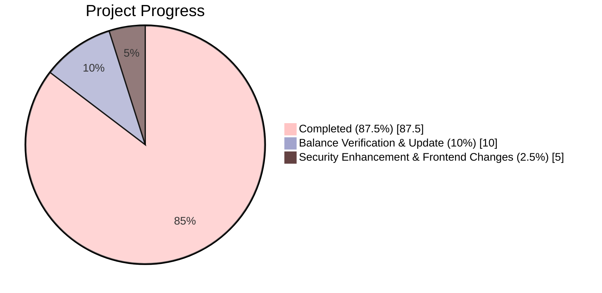

# 🪙 CryptoConnect


**An educational crypto trading simulator with AI-powered insights**

--- 

## 📘 Overview

**CryptoConnect** is a sandbox-style cryptocurrency trading platform that lets students and beginners learn real-world trading **without financial risk**.  
Users receive **fake tokens** to simulate trading activities like buying, selling, and tracking assets using **live crypto market APIs**.  
The system also integrates an **LLM (Gemini)** to provide **AI-powered market insights and learning assistance**.

---

## 🎯 Core Features

- 💰 **Fake currency trading** – buy/sell crypto using simulated funds  
- 📊 **Real-time price tracking** via public API and Websockets 
- 📈 **Portfolio management** – view holdings, transaction history, and wallet balance  
- 🤖 **AI-powered analysis** – Gemini LLM offers trend predictions and explanations (Upcoming)  
- 🔒 **Secure backend** – Node.js + Express + Sessions + Supabase authentication

---

## 🧱 Tech Stack

| Layer | Technology |
|-------|------------|
| Frontend | HTML, CSS, JavaScript |
| Backend | Node.js, Express | Sessions
| Database | Supabase |
| AI Integration | Included in the next update |
| Version Control | GitHub |
| Development Process | Agile (Scrum) |


## 👥 Team D Roles

| Name | Role |
|------|------|
| **Eman Hussien** | Project Manager |
| **Sahil Mohammed** | Quality Assurance & Testing |
| **Abel Negatu** | Backend Developer, Frontend Developer |
| **Mareisha Banga** | UI/UX Designer |
| **Ryan Rich** | Database Manager |

---

## 🔄 Agile Workflow

| Step | Role | Key Deliverable |
|------|------|----------------|
| 1️⃣ | Project Manager | Defines user stories & timeline |
| 2️⃣ | UI/UX Designer | Creates wireframes & platform layout |
| 3️⃣ | Database Manager | Builds schema for users, wallets, and transactions |
| 4️⃣ | Backend Developer | Implements APIs & trading logic |
| 5️⃣ | Frontend Developer | Integrates UI with backend routes |
| 6️⃣ | QA & Testing | Validates, debugs, and refines system |

---

---

## 🚀 Setup & Run

**1. Clone the repository**
```bash
git clone https://github.com/anm1234/IS-436-System-Structure-and-Analysis.git
cd IS-436-System-Structure-and-Analysis
